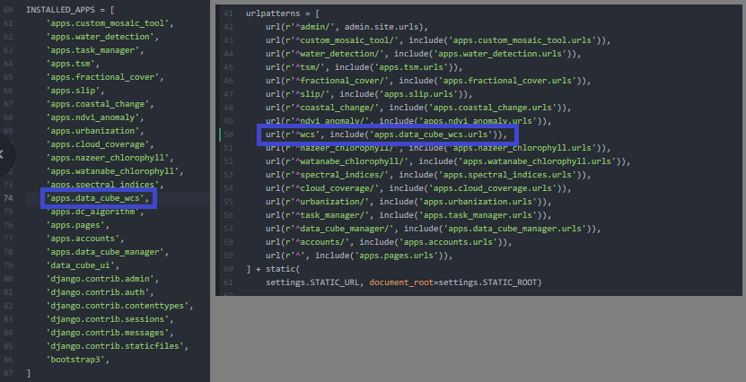
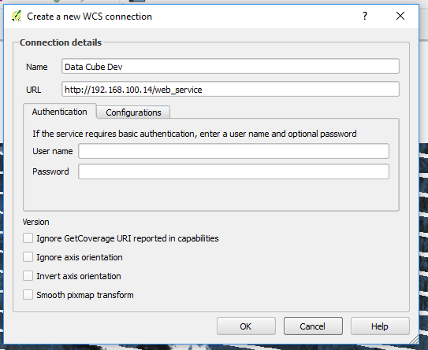

======================
Django Data Cube WCS
======================

A(n) (mostly) OGC compliant WCS server for a Data Cube instance. This app uses an existing Data Cube installation and allows external toolsets to use the data using a WCS connection. Models are automatically generated for Data Cube products using the Data Cube API and all data is managed automatically. Range subsetting is enabled via the GET parameter 'measurements'. As of the current version, only GET/KVP is supported - POST and XML encoding is left out for simplicities sake.

More information about the specification can be found [here](http://portal.opengeospatial.org/files/05-076&passcode=97mkvnjf54t6mph0yryk) or in the docs directory of this repository. The test specification implemented is based on the published teamengine implementation found [here](https://cite.opengeospatial.org/teamengine/about/wcs/1.0.0/site/testreq.html).

Requirements
------------

- A working Data Cube installation and data
- Python 3+
- Django >= 1.8
- bs4
- numpy
- xarray
- rasterio
- configparser
- pytz
- dateutil

*All functionality tested using Python 3.5 and Django 1.11*

Installation
------------

1. Clone this repository and move the data_cube_wcs directory into your project apps directory.

2. Add to INSTALLED_APPS in your Django settings file and include the urls in your project urls.py.



3. Create the initial database migrations and load fixtures:

```
python manage.py makemigrations data_cube_wcs && python manage.py migrate && python manage.py loaddata apps/data_cube_wcs/fixtures/init.json
```

4. Generate the coverage details for your Data Cube products

```
python manage.py shell

from apps.data_cube_wcs.models import CoverageOffering
CoverageOffering.update_or_create_coverages(update_aux=True)

```

5. Modify your database settings or add a new settings variable for your Data Cube database. Either put an absolute path to a .datacube.conf file in the DATACUBE_CONF_PATH settings variable or ensure that your default database is the same as your Data Cube database. The default database settings must have the same hostname, username, and password as your .datacube.conf file.

6. Restart your webserver

7. Run tests if desired. Change the base url in the test/test_wcs_spec.py file and run the tests with nose

```
nosetests
```

Usage
------------
Some sample use cases can be seen below:

1.	GetCapabilities: http://192.168.100.14/wcs?SERVICE=WCS&REQUEST=GetCapabilities&VERSION=1.0.0
2.	DescribeCoverage: http://192.168.100.14/wcs?SERVICE=WCS&REQUEST=DescribeCoverage&VERSION=1.0.0
3.	GetCoverage: http://192.168.100.14/wcs?SERVICE=WCS&VERSION=1.0.0&REQUEST=GetCoverage&FORMAT=GeoTIFF&COVERAGE=ls7_ledaps_lake_baringo&TIME=2005-03-13T07:38:40&BBOX=35.94909958290008944,0.5126834831999999,36.44873960490009068,0.73776403679999991&CRS=EPSG:4326&RESPONSE_CRS=EPSG:4326&WIDTH=120&HEIGHT=120&measurements=red,green,blue

You can replace the IP address with the address of your server. Additionally, you can visualize the data using QGIS by adding a new WCS layer like below:




Adding New Formats
------------

You can add some server processed output formats to the WCS server fairly simply.

1. Create a Format model from the Django admin panel. Include a descriptive name and the response headers (image/tiff)

2. Add the model to whatever products you would like it accessible from the Django admin panel. For each product, select the additional product and then save the model.

3.  For each product, handle the formatting operation models.py -> Format.process_dataset. There are some examples there of formatting standard RGB or filtered mosaics. 
